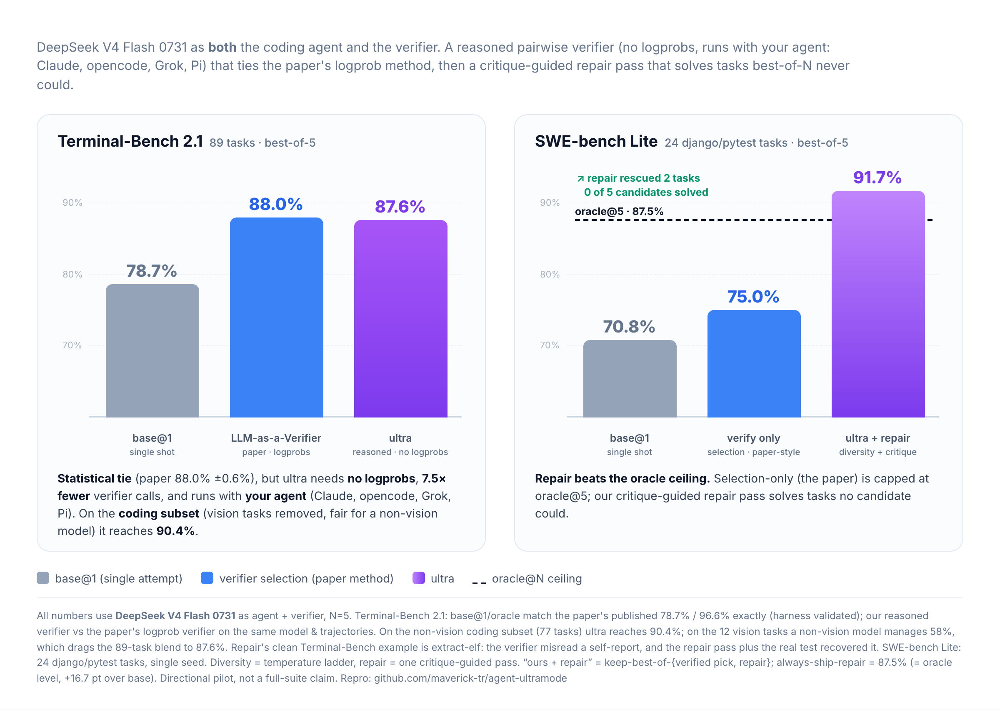

# Verify, Then Repair: Model-Agnostic Best-of-N for Coding Agents, Past the Selection Ceiling

**maverick-tr** · [github.com/maverick-tr/agent-ultramode](https://github.com/maverick-tr/agent-ultramode)

*agent-ultramode ("ultra") v2 technical report.*

## At a glance

### Opus-5-level coding from a flash model at a fraction of the cost


*Vision tasks removed (a non-vision model cannot fairly do them): ultra reaches **90.4%** on the coding subset, inside the tier of GPT-5.6 Sol (89.5%), Claude Opus 5 (89.1%) and Grok 4.6 (88.4%), on a model at a fraction of the per-token cost. This is best-of-5 against the frontier's pass@1, so it is reaching the tier, not a like-for-like beat.*



*ultra's reasoned verify ties the published logprob verifier (87.6% vs 88.0%) with 7.5x fewer calls and no logprobs, so it runs on any model, including Claude. On pure-code SWE-bench Lite, verifier-guided repair beats the oracle@5 ceiling (91.7% vs 87.5%), solving tasks no candidate did.*

---

## Abstract

Best-of-N (BoN) sampling with a learned or prompted verifier is an effective way to spend inference compute on coding agents: generate several candidate solutions, then select the best one. The recent "LLM-as-a-Verifier" line of work ([Kwok et al., 2026](https://arxiv.org/abs/2607.05391)) and its official implementation, [TurboAgent](https://github.com/llm-as-a-verifier/TurboAgent), formalize this as a **Probabilistic Pivot Tournament (PPT)** whose per-duel signal is the verifier's **token logprob distribution** over score letters. That signal is strong, but it has two structural constraints: it requires a serving stack that exposes token logprobs (which rules out closed models such as Claude, since no logprobs are exposed), and it performs pure **selection**, so it can never exceed the oracle@N ceiling defined by the candidate pool.

We contribute two changes and measure them honestly against the original method on the original data and model.

1. **A reasoned same-model verifier.** Instead of reading logprobs, the verifier reads the candidate solutions and emits a short written analysis ending in a parseable `FINAL: A` or `FINAL: B` verdict. This needs no logprobs and no separate verifier model, so it runs on any model, including Claude. On the paper's own pre-collected Terminal-Bench 2.1 trajectories (89 tasks, best-of-5), using the exact same model that produced them, ultra's reasoned PPT reaches **87.6%** resolved versus a base@1 of **78.7%** and an oracle@5 of **96.6%**. This **ties** the paper's published logprob PPT (**88.0% +/- 0.6%**, ultra's result is inside that interval) using roughly **7.5x fewer verifier calls** (576 vs 4,320) and zero logprobs. Base@1 and oracle@5 match the paper's published numbers exactly, validating the harness.

2. **Verifier-guided repair.** After selection, the verifier writes a critique of the chosen winner, and a guided repair stage (best-of-N repair with adaptive early-exit) attempts to fix the remaining problems. A repaired candidate is kept **only if it verifies better** than the winner (a repository or task test when one exists, otherwise the reasoned verifier). Because repair can synthesize a fix that no candidate produced, it can break the oracle@N ceiling that pure selection cannot. On a 24-task SWE-bench Lite slice (pure code diffs, execution-grounded via the official test harness), verifier-guided repair with a keep-whichever-passes policy reaches **91.7%** resolved, **above** the oracle@N of **87.5%**, with 2 verified rescues that no candidate achieved.

Two honest scope notes frame the whole writeup. First, the eval model has **no vision**: on Terminal-Bench 2.1's 12 vision/image tasks it scores 58% (it writes image-detection code blind), on the 77 coding tasks it scores 90.4%, and the 89-task blend is the 87.6% above. The coding subset is the fair arena for a small, non-vision flash model, and 90.4% there reaches the frontier's tier at a fraction of the cost (ultra's number is best-of-5; frontier all-task numbers are pass@1), which we frame as reaching the tier, not beating it. Second, a **trace-reading ceiling** limits repair on self-reported terminal outcomes: on a fresh 10-task Terminal-Bench headroom run in real containers, repair plus a real container test recovered one task the verifier misjudged (extract-elf), but there was no beyond-oracle rescue this run. Repair helps on Terminal-Bench but is not a ceiling-breaker there; the clean "repair beats oracle" result is the pure-code SWE-bench slice.

The eval model is a self-hosted small open model (DeepSeek V4 Flash 0731). All comparisons are same-model, same-trajectory, same-tournament.

---

## 1. Introduction and motivation

Coding agents are increasingly evaluated on patch-based and terminal benchmarks where a single sampled attempt is far from the model's true ceiling. Sampling N attempts and keeping the best one (best-of-N) is a simple way to convert extra inference compute into accuracy, but it only pays off if you can actually pick the best attempt without access to the hidden grader.

The [LLM-as-a-Verifier](https://arxiv.org/abs/2607.05391) work (Kwok et al., 2026), and its official open implementation [TurboAgent](https://github.com/llm-as-a-verifier/TurboAgent), address selection directly and well. TurboAgent is a transparent proxy (it sits in front of Claude Code / opencode) that runs best-of-N and then a Probabilistic Pivot Tournament: candidates are arranged in a seeded ring, pairwise duels are scored, and pivots resolve the ranking. The per-duel score is computed from the verifier model's **logprob distribution** over a set of score letters, read via a prefill trick, and aggregated into an expected score. On Terminal-Bench 2.1 self-verification with a small open model, the paper reports best-of-5 lifting from 78.7% (pass@1) to 88.0% resolved, against an oracle@5 of 96.6%. This is a genuinely strong result and it is the baseline we credit and compare against throughout.

The logprob signal, however, imposes two structural constraints that motivate ultra:

- **It needs token logprobs.** The verifier must run on a serving stack that exposes per-token logprobs and supports a prefill trick over score letters. Closed models such as Claude expose no logprobs, so the paper's verifier cannot be Claude; it forces a separate, logprob-exposing verifier model. In an agent product where the user already runs Claude (or any single model), requiring a second model with a specific serving capability is a real deployment tax.
- **It is pure selection.** No matter how good the verifier is, selection can never exceed **oracle@N**: if none of the N candidates solved the task, selection cannot invent a solution. On the paper's own data, oracle@5 (96.6%) sits far above the verifier (88.0%), and much of that remaining gap is not "the verifier picked wrong" but "no candidate was correct."

We ask two questions. First: if we replace the logprob signal with a **reasoned** verdict (read the candidates, write a short analysis, emit `FINAL: A/B`), do we lose accuracy? A reasoned verdict removes both the logprob requirement and the separate-verifier requirement, so if it matches the logprob PPT, the same method now runs on any model, including Claude. Second: can we break the oracle@N ceiling? If the verifier can write a critique, we can feed that critique into a guided repair stage, and keep the repair only when it verifiably improves. Repair can produce a fix that no candidate produced, so it can exceed oracle@N, which selection alone cannot.

ultra's contribution is therefore not a better benchmark number on the paper's own method (ultra ties it, and we credit them for the method). It is (a) making that method model-agnostic and logprob-free at no measured accuracy cost, and (b) adding an execution-grounded repair loop that can break the selection ceiling where the task is pure code and a test exists. We report the wins, the ceilings, and the null results with equal weight.

---

## 2. Method

The shape of ultra's pipeline before the prose:

```
              N task attempts, each in its own isolated git worktree
              (lean sandbox, genuinely independent parallel runs)
                        |    |    |    ...    |
                        A    B    C          N
                        \____|____|____ ... __/
                                 |
                                 v
         Reasoned Probabilistic Pivot Tournament (PPT)
         seeded ring + pairwise duels, each duel a written
         analysis ending in FINAL: A / FINAL: B
         (verifier = the SAME model that produced the attempts,
          no logprobs, no separate verifier model)
                                 |
                                 v
                    confidence-gated apply
              high confidence -> apply winner to working tree
              low confidence  -> surface candidates to the user
                                 |
                                 v
              critique the winner (what is still wrong)
                                 |
                                 v
         best-of-N repair passes (repairN, adaptive early-exit)
         each pass seeded with winner diff + critique
                                 |
                                 v
         keep a repair ONLY if it verifies strictly better
         (a real test when one exists, else the reasoned verifier);
         otherwise keep the winner unchanged  ->  never worse than selection
```

### 2.1 Probabilistic Pivot Tournament (recap of the baseline)

We reuse the paper's tournament verbatim. For a task with N candidate trajectories:

1. Arrange candidates in a seeded ring (fixed seed so both methods see identical topology).
2. Run a ring pass of pairwise duels plus a configurable number of pivot rounds. We pin the paper's best-of-5 configuration: **K = 2, pivots = 1, seed = 0**.
3. Each duel is scored by a per-duel signal (see below). Position bias is cancelled by running each duel in both slot orders (odd repetitions swap A and B) and combining.
4. The tournament aggregates duel outcomes into a single winner and a confidence.

Only the **per-duel signal** differs between the baseline and ultra. Everything else (ring construction, pivot logic, seed, metric formulas, trajectory loading) is the paper's code, imported directly.

**Baseline signal (logprob PPT).** For each duel the verifier scores three criteria (specification adherence, output match, error signals). Each criterion is scored with three model calls: one analysis pass, then two prefill passes that read the logprob distribution over `<score_A>` / `<score_B>` letters via structured outputs and continuation of the final message. This produces an expected fine-grained score per criterion. Per duel: 6 criterion evaluations, each 3 calls.

### 2.2 Reasoned FINAL:A/B verification (ultra)

ultra's per-duel signal replaces logprobs with a single reasoned verdict. For each duel the verifier receives both candidates and is asked to briefly analyze three checks (did the final command succeed, does the output match the requirement, are there unresolved errors), then to output a decision on its own line as `FINAL: A` or `FINAL: B`. We parse the last such marker. Per duel: 2 repetitions (to cancel position bias), each 1 model call.

This has three consequences:

- **No logprobs.** The signal is text the model already produces, so the verifier can be any chat model, including Claude and other closed models. This is the property TurboAgent's logprob verifier structurally lacks.
- **No separate verifier model.** The same model that generated the candidates can verify them (same-model verification), which is what we measure below.
- **Far fewer calls.** One holistic reasoned call per repetition replaces six criteria times three calls. On the 89-task best-of-5 run this is 576 verifier calls versus the paper's 4,320.

Verdict parsing is robust in practice: on the full run, 98.3% of verifier calls produced a clean `FINAL` parse (566 of 576); the remaining 1.7% (None / tie) fall back to the tournament's tie handling. A/B choices were balanced 254/312 after slot swapping, indicating no gross position bias.

### 2.3 Execution-grounded repair (ultra)

Selection is bounded by oracle@N. To go past it we add a repair stage after selection:

1. **Critique.** The reasoned verifier writes what is still wrong with the selected winner (a targeted description of the remaining failure, not a holistic vote).
2. **Repair (best-of-N with adaptive early-exit).** Repair is itself best-of-N: it runs up to N repair passes (`repairN`, default 2), each an agent pass seeded with the winner's diff plus the critique. N is an upper bound, not a fixed count: as soon as a repair attempt passes the available test it stops early (adaptive early-exit), so the extra passes are only spent when the first one does not yet pass. If none pass, the stage keeps the best repair attempt by the reasoned verifier. This makes repair regression-safe by construction: keeping the first test-passing attempt (else the best-verified one) is never worse than any single winner, and the multiple passes raise the chance a fix is found without inflating cost on the easy cases.
3. **Keep-policy (the never-hurts guarantee).** The repair-stage output is kept **only if it verifies strictly better** than the selected winner. When a test command exists (passed explicitly via a flag, or auto-detected for npm / pytest / cargo / go, or the task's own test on Terminal-Bench), we run it on the winner and on the repair output and keep the repair only if it is regression-free and fixes strictly more. When no runnable test exists, the reasoned verifier must clearly prefer the repair. If neither holds, the repair is discarded and the selected winner is shipped unchanged.

Because the keep-policy is a strict "better or discard" gate, repair can lift accuracy past the best-of-N ceiling but can never make the result worse than plain selection. We validated both directions locally with a mock agent: in a keep case, a partial winner plus a completing repair passed tests the winner failed and was kept; in a discard case, a repair that regressed tests was discarded and the (passing) winner was retained.

### 2.4 Confidence-gated apply and git-worktree isolation

The tool is a "solve and apply" tool, not just a response proxy, so two engineering properties matter for the product even though they do not change the benchmark math:

- **Git-worktree isolation.** Each attempt runs in its own git worktree with a lean sandbox, giving genuinely independent parallel agent runs. This is also what makes execution-grounded repair possible: candidates and repairs can be built and tested in isolation. TurboAgent, being a transparent proxy, has no such isolation.
- **Confidence-gated apply.** When the tournament's confidence is high, the winning (or kept-repair) diff is applied to the working tree; when confidence is low, the candidates are surfaced for the user to choose. Confidence is a real but noisy signal (a known limitation we carry forward), so it gates an action rather than being reported as a calibrated probability.

---

## 3. Experimental setup

**Model.** All generation and all verification use a single self-hosted small open model, DeepSeek V4 Flash 0731, served with an OpenAI-compatible endpoint. This model has **no vision** (Section 4.2 quantifies the effect on the mixed benchmark). For Experiment 1 the serving stack also exposes logprobs, so the baseline logprob PPT can in principle be reproduced on the same box; for the head-to-head we compare ultra's result against the paper's published numbers (see below), which were produced by the same model weights.

**Experiment 1 (apples-to-apples verification).** Data is the paper's own pre-collected trajectory set: Terminal-Bench 2.1, mini-swe-agent driven by the same model, **89 tasks x 5 trials**, each trial carrying a held-out reward (1/0) ground-truth label. Because the trajectories are pre-collected and labeled, both methods see identical inputs and the only variable is the per-duel signal. We run full trajectories with no trace cap, matching the paper's published full-trace configuration. We use the paper's tournament code and metric formulas unchanged. ultra's run is a single seed (seed 0); the paper's published 88.0% is a multi-seed mean, which we treat as the comparison target and flag as a limitation (Section 7).

**Experiment 3 (repair, SWE-bench Lite, execution-grounded, pure code).** We generate candidates with mini-swe-agent driven by the same model, using a temperature ladder (temperatures 0, 0.3, 0.6, 0.9, 1.1) for diversity, N = 5. Candidates are evaluated with the official SWE-bench Lite Docker harness (real `FAIL_TO_PASS` / `PASS_TO_PASS` tests), which is an honest, hidden grader. The reported slice is 24 tasks (22 django, 2 pytest) from the test split, chosen because the model has a meaningful swing band there (see Section 5 on subset selection). These are code-diff tasks with no vision component, so the non-vision handicap does not apply here. Images are linux/amd64 and run under emulation on an arm64 host; the platform flag must be forced for both generation and eval.

**Experiment 3b (repair, Terminal-Bench headroom, real containers).** We generate candidates on the paper's own benchmark family with a mini-swe-agent adapter, N = 5, then run reasoned selection, a per-task critique, and a repair stage on the tasks whose selected pick failed. On Terminal-Bench the task's own test is an honest oracle, so the keep-policy is legitimately test-based here. The reported slice is 10 swing-rich tasks run in real Terminal-Bench containers with up to a few in parallel and cooling breaks. This is deliberately a hard subset, not full Terminal-Bench, and it is a fresh single run (variance caveat in Section 7).

**Metrics.**

- **base@1**: expected single-attempt resolve rate = mean over attempts of pass/fail.
- **oracle@N**: 1 if any of the N attempts resolves; the ceiling selection can reach.
- **verifier / reasoned-pick**: the reasoned verifier's top pick resolves.
- **repair (ship)**: always ship the repair-stage output.
- **repair (union / safe-union)**: keep whichever of {winner, repair} resolves, per the keep-policy.
- **captured headroom**: (method - base@1) / (oracle@N - base@1), the fraction of the base-to-oracle gap recovered.

---

## 4. Results

### 4.1 Experiment 1: reasoned PPT vs logprob PPT (Terminal-Bench 2.1, best-of-5, same model)

Ground-truth structure of the 89 tasks: 50 all-pass, **36 swing**, 3 all-fail. The verifier can only change the outcome on the 36 swing tasks; the maximum verifier headroom is +16 tasks.

| Method | Resolved | Rate | Swing hits | Captured headroom | Verifier calls | Logprobs |
|---|---|---|---|---|---|---|
| base@1 | 70.0 / 89 | 78.7% | -- | -- | -- | -- |
| **ultra (reasoned FINAL:A/B, holistic)** | **78 / 89** | **87.6%** | 28 / 36 | **50.0%** | **576** | **no** |
| theirs (logprob PPT, 3-criteria) [published] | ~78.3 / 89 | **88.0% +/- 0.6%** | ~28 / 36 | ~52% | 4,320 | yes |
| oracle@5 | 86 / 89 | 96.6% | 36 / 36 | 100% | -- | -- |

ultra's 87.6% is inside the paper's published 88.0% +/- 0.6% interval, i.e. a statistical tie. Crucially, base@1 (78.7%) and oracle@5 (96.6%) match the paper's published best-of-5 numbers **exactly**, which validates that ultra's data loading and metric formulas are faithful to theirs; only the per-duel signal differs.

**Takeaway.** Dropping logprobs for a reasoned `FINAL: A/B` verdict costs on the order of 0.4 points (within noise) while using roughly 7.5x fewer verifier calls (576 vs 4,320) and removing the logprob requirement entirely, so the same method runs on Claude or any chat model. This is the paper's own result, reproduced more simply and made model-agnostic.

### 4.2 The non-vision handicap: judging the model fairly

The eval model has no vision. Terminal-Bench 2.1 is a mixed benchmark: 12 of its tasks are vision/image tasks (the agent must reason over an image), and 77 are coding tasks. A non-vision model has to attempt the vision tasks blind, typically by writing image-detection or image-parsing code and hoping, so those 12 tasks are systematically out of reach and drag the blended number down. Splitting the same 89-task best-of-5 result by task type makes the handicap explicit:

| Subset | Tasks | Rate | Note |
|---|---|---|---|
| Vision / image tasks | 12 | 58% | model writes image-detection code blind, no vision |
| Coding tasks | 77 | 90.4% | the fair arena for a small, non-vision flash model |
| Full blend (as reported in 4.1) | 89 | 87.6% | vision tasks depress the blend |

**The fair arena is the coding subset.** For a model with no vision, the vision tasks measure a capability it structurally does not have, so the 77-task coding subset is where its coding ability is actually observed, and there it resolves 90.4% (best-of-5, this method).

**Frontier context (framing, not a beat claim).** On Terminal-Bench 2.1 all-task aggregate (pass@1, average of 3, Artificial Analysis), current frontier models report GPT-5.6 Sol 89.5%, Claude Opus 5 89.1%, and Grok 4.6 88.4% (vals.ai reports lower, e.g. Sol 85.77%). Their coding-subset numbers are not published, so a direct subset-to-subset comparison is not available. The honest framing is therefore: a self-hosted small open model with no vision reaches the frontier's tier on the coding subset (90.4%) at a fraction of the cost, **not** that it beats the frontier. Two things forbid a beat claim: ultra's 90.4% is best-of-5 while the frontier numbers are pass@1, and the subsets are not the same population (ultra's is coding-only, theirs is all-task). We report this as reaching the tier, and only on the coding arena where a non-vision model can be judged fairly.

### 4.3 Experiment 3: verifier-guided repair (SWE-bench Lite, 24 tasks, pure code, execution-grounded)

Ground-truth structure of the 24 tasks: 13 all-pass, **8 swing**, 3 all-fail (a properly powered swing band). These are code-diff tasks with no vision component.

| Method | Resolved | Rate | vs oracle@5 | Captured headroom |
|---|---|---|---|---|
| base@1 | 17 / 24 | 70.8% | -- | -- |
| reasoned-pick (selection only) | 18 / 24 | 75.0% | -12.5 pt | 25.0% |
| repair, always ship | 21 / 24 | 87.5% | = oracle level | 100.0% |
| **repair, safe-union (keep whichever passes)** | **22 / 24** | **91.7%** | **+4.2 pt over oracle** | **~125%** |
| oracle@5 | 21 / 24 | 87.5% | -- | 100% |

The safe-union captured-headroom exceeds 100% by construction, because repair can resolve tasks outside the candidate pool; we report it to make the over-oracle effect explicit rather than as a bounded fraction.

**Takeaway (the clean flagship for repair-beats-oracle).** Verifier-guided repair beats oracle@N on pure code. Two tasks that none of the 5 candidates solved (django-15320, django-16820) were fixed by the critique-guided repair pass, both verified via the real `FAIL_TO_PASS` tests (a subquery-SQL test and two migration-optimizer tests), with base candidates at 0/5. Plain best-of-N and selection-only PPT cannot exceed oracle@N; diversity + reasoned selection + repair does. Repair also broke 1 task (django-13447) before the keep-policy; the safe-union keep-policy is what converts "always ship" (87.5%, exactly oracle level) into the over-oracle 91.7% by discarding regressive repairs. Note that the 91.7% keep decision in this offline analysis uses the hidden grader to decide keep-vs-discard; a deployable version uses an execution check (a regression test) for that decision, which is the clean, gold-independent signal the tool auto-detects. This is the flagship result for "repair beats oracle" precisely because it is pure code with a real test and no vision.

### 4.4 Experiment 3b: verifier-guided repair (Terminal-Bench headroom, 10 tasks, real containers)

Fresh single run, 10 swing-rich tasks in real Terminal-Bench containers.

| Method | Resolved | Rate | vs oracle@5 |
|---|---|---|---|
| base@1 | ~2.6 / 10 | 26.0% | -- |
| reasoned-pick (selection only) | 3 / 10 | 30.0% | -30.0 pt |
| repair, ship | 1 / 10 | 10.0% | below oracle |
| repair, safe-union (keep whichever passes) | 4 / 10 | 40.0% | below oracle |
| oracle@5 | 6 / 10 | 60.0% | -- |

**Takeaway (modest, honest).** Repair helps on Terminal-Bench but is not a ceiling-breaker here. The one clean win this run is **extract-elf**: the reasoned verifier selected a failing attempt because a losing run self-reported success convincingly (the trace-reading ceiling, Section 5.1), and the critique-guided repair pass plus the real container test then recovered the task (the repair candidate passed both parser tests, accuracy 1.0). That is the clean example of overcoming the trace-reading ceiling with a real test where selection alone could not. But there was **no beyond-oracle rescue** this run: nothing outside the 5-candidate pool was solved, and the safe-union (40.0%) stays below oracle@5 (60.0%). The "always ship" column (10.0%) is far below oracle, which is exactly why the keep-policy exists: safe-union discards the regressive repairs and recovers to 40.0%.

Two honest points. First, an earlier one-off run had a chess-best-move rescue beyond oracle; it **did not reproduce** here (chess-best-move repair failed this run), so we do not carry it as a result. Second, this is a small, hard, fresh single run: the swing band is thin (only 6 of 10 are solvable within 5 attempts) and the selection-only verifier does not clear the ceiling on noisy terminal casts. The clean over-oracle headline stays with the SWE-bench pure-code slice (Section 4.3); on Terminal-Bench, repair is a real but modest help that shines exactly where a real test can adjudicate a convincing-but-wrong self-report.

---

## 5. Analysis

### 5.1 The trace-reading ceiling (the central limitation)

Experiment 1 and Experiment 3b both land against the same wall, and dissecting it explains why the verifier ties the logprob PPT rather than beating it, why it can underperform base@1 on terminal logs, and why repair is a ceiling-breaker on pure code but only a modest help on self-reported terminal outcomes.

In Experiment 1 ultra's reasoned verifier hit 28 of 36 swing tasks and missed 8. Reading the trace tails of the 8 misses, they are all the same failure mode: **convincing-but-wrong self-reports**. On these tasks the failing candidate and the passing candidate both narrate success, and the failing one is frequently the more thorough-sounding of the two. Two concrete examples from the misses:

- **extract-elf**: the failing candidate reported "4102 entries, verified byte-for-byte, zero mismatches"; the passing candidate reported "698 entries, exact match". 698 is the correct interpretation and 4102 is wrong, but nothing in either trace says which reading is right.
- **pytorch-model-cli**: the failing candidate reported "verified outputs 2, matches high-precision reference exactly"; the passing candidate made the same claim. In every miss, the trace's final verification command shows the action was not actually executed, so the ground truth (did the output really match?) is simply **not in the trace**.

This is the core honest finding. A verifier that only **reads the trace**, whether it reads reasoning (ultra) or reads logprobs (theirs), cannot recover a task where the agent lied convincingly and the proof was never logged. This is exactly why both methods land near 88% and both miss a similar ~8 tasks: they are at the ceiling of trace-reading, and no prompt tweak, extra criterion, higher K, or logprob fusion can cross it. It is the same self-verification ceiling the original work documents.

The one lever that recovers these tasks is **execution-grounded** verification: actually run each candidate's artifact and check its output (which binary prints the right digit, 698 vs 4102 entries). The fresh Terminal-Bench headroom run shows this working on exactly the extract-elf task from the Exp-1 misses: the reasoned verifier again selected a convincing-but-wrong self-report, and the repair pass plus the **real container test** recovered it (Section 4.4). That is the clean, reproduced example of a real test overcoming the trace-reading ceiling. It needs runnable environments, which the offline Exp-1 dataset does not ship (traces only), which is why execution grounding and repair moved to SWE-bench Lite and live Terminal-Bench containers.

The same ceiling explains repair being a ceiling-breaker on SWE-bench but not on the Terminal-Bench headroom run. On SWE-bench the candidate is a **code diff**, where the change itself is inspectable and a repository test adjudicates cleanly, so repair went past oracle (Section 4.3). On Terminal-Bench the trajectory summaries are raw terminal casts dominated by apt/pip install noise, so the readable signal is both thin and adversarial: a real test can rescue an individual misjudged task (extract-elf), but the selection signal is weak enough that the aggregate stays under oracle and the selection-only verifier can even trail base@1. The lesson for practitioners: this class of verifier, and repair on top of it, is strong on inspectable code diffs and only modestly helpful on self-reported terminal outcomes, where its value is confined to the tasks a real test can adjudicate.

### 5.2 Why repair can beat oracle, and why it sometimes does not

Selection is bounded by oracle@N by definition. Repair is not, because a critique-guided pass can synthesize a fix present in none of the candidates. The django slice shows the clean version of this: 2 tasks with 0/5 candidates were solved by repair and verified by real tests. The mechanism works when (a) the task is within the model's capability given a good pointer to what is wrong, and (b) the verifier can write an actionable critique, which in turn needs an inspectable artifact. Best-of-N repair with adaptive early-exit (Section 2.3) raises (a) by giving the model more than one guided attempt while keeping cost bounded on the easy cases.

When those conditions fail, repair does not beat oracle. On the fresh Terminal-Bench headroom slice, several tasks are beyond the model's capability regardless of critique quality (a critique cannot manufacture a missing capability), and the critiques themselves are degraded by the noisy-cast problem from 5.1. So repair recovered the one task where a real test could adjudicate a misjudged pick (extract-elf) but produced no beyond-oracle rescue, and the earlier chess-best-move rescue did not reproduce. This is why we report the average lift and the recoverable-slice behaviour separately: on the SWE-bench slice the over-oracle effect is large and clean; on the Terminal-Bench slice repair is a modest help capped below oracle this run.

### 5.3 Average vs recoverable-slice, and subset selection

The average lift over a full benchmark is dominated by tasks that are all-pass (verifier and repair are irrelevant) or beyond-capability (no method recovers them). The interesting quantity is the swing band, and it is sensitive to subset choice. An early SWE-bench Lite pilot on pvlib (a scientific library with thin training coverage) had only 1 swing task in 8 and produced a near-flat, noisy result; the same model on django (heavily represented in training) solves roughly 70% per attempt and yields a properly powered 8-swing band in 24 tasks. We therefore state subset composition explicitly (all-pass / swing / all-fail) for every experiment and caution that headline rates are not comparable across subsets with different swing structure. The Exp-3b slice is intentionally hard and is not full Terminal-Bench; the flagship-comparable full-benchmark number in this writeup is the Exp-1 verifier at 87.6% on all 89 tasks (90.4% on the fair coding subset, Section 4.2).

### 5.4 Cost of the reasoned signal

Beyond accuracy, the reasoned verifier is materially lighter: 576 verifier calls versus 4,320 for the logprob PPT on the same 89-task best-of-5 run, roughly 7.5x fewer calls, with no logprob prefill machinery. For a single Exp-1 run ultra's verifier used about 15.1M input tokens and 76k output tokens (uncached). Fewer calls plus no logprob requirement is the practical case for the reasoned signal even where a logprob-capable verifier is available.

---

## 6. Related work

**LLM-as-a-Verifier (Kwok et al.) and TurboAgent.** This work is the direct basis for ultra and we credit it generously. The paper introduces best-of-N with a Probabilistic Pivot Tournament and a logprob-based per-duel verifier, and its official implementation, TurboAgent, is a transparent Claude Code / opencode proxy that runs the method in front of a live agent. The published Terminal-Bench 2.1 self-verification numbers with a small open model (best-of-5: pass@1 78.7%, verifier 88.0% +/- 0.6%, oracle 96.6%, 4,320 verifier calls) are the baseline we reproduce and compare against. Their reported cross-benchmark lifts (for example Terminal-Bench V2 83.1% to 86.5%, SWE-bench Verified 76.1% to 78.2% with a separate verifier model) established that the method generalizes. ultra's tournament code, ring construction, pivot logic, seed, trajectory loaders, and metric formulas are theirs, imported directly; ultra changes only the per-duel signal and adds a repair stage. We do not claim to out-benchmark their method on their own selection task; on that task ultra ties it and makes it model-agnostic.

**Positioning.** ultra's contribution is best read as complementary. The reasoned verifier removes the logprob and separate-verifier requirements at no measured accuracy cost, extending the method to closed models such as Claude and to any single-model agent. Verifier-guided repair adds a capability the selection-only formulation cannot have (exceeding oracle@N), enabled by the isolated-worktree execution architecture rather than a transparent proxy, and demonstrated cleanly on pure code. Best-of-N and self-verification more broadly build on a large body of sampling-and-reranking and self-critique work; the specific claims are scoped to the head-to-head against the logprob PPT on the same model and data.

---

## 7. Limitations and honest framing

- **Single seed in Experiment 1.** ultra's 87.6% is a single-seed (seed 0) result; the paper's 88.0% is a multi-seed mean with a reported +/- 0.6% interval. ultra's point estimate is inside that interval, so we describe the relationship as a statistical tie, but a 3-to-5 seed run of ultra is needed to report its own mean and interval and to firm the tie. We have not run a same-box reproduction of the logprob PPT (4,320 calls) here; we compare against the paper's published numbers, having validated the harness via exact base@1 and oracle@5 matches. A same-box reproduction would remove any "selective published number" concern and is the obvious next step.

- **The eval model has no vision.** On Terminal-Bench 2.1's 12 vision/image tasks it scores 58% because it must attempt them blind by writing image-detection code; the 90.4% coding-subset number is the fair measurement of its coding ability, and the 87.6% blend is dragged down by the vision tasks. We frame the coding subset as reaching the frontier's tier at a fraction of the cost, not beating the frontier: ultra's 90.4% is best-of-5 while the frontier all-task numbers are pass@1, and the coding-subset numbers of frontier models are not published, so no like-for-like beat claim is possible.

- **The trace-reading ceiling is real and central.** On self-reported terminal outcomes the verifier cannot exceed what the trace reveals, and it can underperform base@1 when the trace is noisy and adversarial (Exp-3b). We do not claim the verifier is good at judging terminal self-reports; we claim it is good at judging code diffs and that execution grounding (a real test) is required for the rest. Reported average lifts are modest; the clean over-oracle result is the pure-code slice.

- **Repair on Terminal-Bench is a modest help, not a ceiling-breaker.** The fresh 10-task headroom run recovered one misjudged task via a real container test (extract-elf) but produced no beyond-oracle rescue, and its safe-union (40.0%) stayed below oracle@5 (60.0%). The earlier chess-best-move beyond-oracle rescue was a one-off that did not reproduce, so we do not carry it. The clean over-oracle headline in this writeup is the SWE-bench slice (91.7% > 87.5%).

- **Fresh-run variance.** Exp-3b is a single fresh run on a small hard subset; agent generation is stochastic and Terminal-Bench swings task-to-task, so the specific per-task outcomes (which task the verifier misjudges, which repair passes) should be read as directional. A multi-run Terminal-Bench study is needed to put an interval on the repair lift there.

- **Execution grounding is not a clean win on SWE-bench (repro-test variant).** A separate experiment tried to ground verification by having the model generate a reproduction test from the issue and running each candidate against it. On a 10-task SWE-bench Lite check, only about 30% of tasks (3/10 aligned, 6/10 misaligned, 1/10 invalid) produced a repro that agreed with the benchmark's PR-based ground truth. The reason is structural: SWE-bench gold means "matches the merged PR," not "fixes the stated problem," so a repro faithful to the problem statement can disagree with the hidden grader (confirmed on one task where the gold patch only reworded an error string and did not stop the false trigger the problem described). Self-generated repro grounding therefore helps on a minority of tasks and adds noise elsewhere; it is a genuine null result. Note this concerns repro-test grounding specifically; the repair keep-policy uses **existing repository (or task) tests**, which is gold-independent and is the clean execution check the tool relies on.

- **Sample sizes and subset composition.** Exp-3 is 24 tasks (8 swing), single seed, django-heavy; other repos are untested. Exp-3b is 10 hard tasks (6 solvable), a single fresh run. These results are directional and verified, not large-sample. We state all-pass / swing / all-fail composition for every experiment because headline rates are not comparable across subsets with different swing structure.

- **Agent scaffold and generation cost.** Where we generate (Exp-3, Exp-3b) we drive the model through mini-swe-agent, not a bespoke leaderboard scaffold, and generation runs under x86 emulation on an arm64 host, so absolute rates are not directly leaderboard-comparable and are framed around lift rather than absolute standing. An earlier exploration with a strong hosted model on a harder patch benchmark, driven via that model's own generic CLI rather than a scaffolded agent, underperformed the leaderboard and was expensive per attempt; we do not report it as a headline and note it only to explain why the apples-to-apples study uses pre-collected trajectories and a self-hosted small open model.

- **Confidence is noisy.** The tournament's confidence gates the apply action; it is not a calibrated probability and should not be read as one.

---

## 8. Conclusion

Best-of-N with a same-model verifier is a strong, simple way to spend inference compute on coding agents, and the LLM-as-a-Verifier work established both the method and a strong logprob-based verifier. We showed two things on the original method's own model and data. First, a **reasoned `FINAL: A/B` verifier** ties the logprob PPT (87.6% inside the published 88.0% +/- 0.6%) while using roughly 7.5x fewer verifier calls and no logprobs, which makes the exact same method run on any model, including Claude, and removes the separate-verifier requirement. Judged fairly for a model with no vision, that same run resolves 90.4% on the 77 coding tasks (the vision tasks it must attempt blind pull the 89-task blend down to 87.6%), reaching the frontier's tier on the coding arena at a fraction of the cost, which we state as reaching the tier and not beating it (best-of-5 vs pass@1, and no published frontier coding-subset number). Second, **verifier-guided repair** with a strict keep-policy and best-of-N repair with adaptive early-exit breaks the oracle@N ceiling that pure selection cannot, reaching 91.7% versus an 87.5% oracle on a pure-code, execution-grounded SWE-bench Lite slice via 2 verified rescues.

We were equally careful to report where the method does not win. Verification that only reads the trace hits a hard ceiling on convincing-but-wrong self-reports, so it is strong on inspectable code diffs and weak on self-reported terminal outcomes; on a fresh Terminal-Bench headroom run, repair plus a real container test recovered one misjudged task (extract-elf) but produced no beyond-oracle rescue, so repair is a modest help there and not a ceiling-breaker; self-generated repro-test grounding is too noisy against SWE-bench's PR-based gold to be a clean win; and the eval model's lack of vision is a real handicap on mixed benchmarks. The net is a method that is simpler and model-agnostic at no accuracy cost on selection, plus a repair loop that provably exceeds the selection ceiling on pure code where a real test exists, offered as a complement to, not a replacement for, the original.

---

## Reproducibility note

- **Model.** A single self-hosted small open model (DeepSeek V4 Flash 0731), served with an OpenAI-compatible endpoint, with no vision capability. The same model weights produced the paper's Terminal-Bench 2.1 trajectories, so Exp-1 is genuinely same-model.
- **Experiment 1 data and code.** The paper's pre-collected Terminal-Bench 2.1 trajectory set (89 tasks x 5 trials, each with a reward label). Tournament, ring construction, pivot logic, trajectory loaders, and metric formulas are the paper's code, imported unchanged; only the per-duel signal is swapped. Config pinned to K = 2, pivots = 1, seed = 0, full trajectories (no cap). ultra's per-duel signal, the cached verdicts (576 verifier calls, 288 duels at 2 repetitions each), and a replay script that recomputes all aggregate and per-swing-task numbers from cache with no further model calls are available on request. base@1 = 78.7% and oracle@5 = 96.6% match the paper's published best-of-5 numbers exactly, which is the harness validation. The vision/coding split (12 vision at 58%, 77 coding at 90.4%, 89 blend at 87.6%) is computed from the same run by task type.
- **Experiment 3 / 3b.** Generation via mini-swe-agent with a temperature ladder (0, 0.3, 0.6, 0.9, 1.1) at N = 5. SWE-bench Lite candidates are scored by the official Docker harness (real FAIL_TO_PASS / PASS_TO_PASS); Terminal-Bench candidates are scored by the task's own test in real containers. Repair is best-of-N (repairN default 2) with adaptive early-exit (stop on the first repair attempt that passes the test, else keep the best-verified). Per-task results (candidates, selection, critique, repair, per-task scores, rescued-beyond-oracle and broke lists) are available on request. Images are linux/amd64 run under emulation; the platform flag must be forced for both generation and eval on arm64 hosts.
- **Determinism caveats.** Exp-1 is a single seed; agent generation in Exp-3 / 3b is stochastic across the temperature ladder, and Exp-3b is a single fresh run. Multi-seed runs, a multi-run Terminal-Bench repair study, and a same-box reproduction of the logprob PPT are listed as next steps in Section 7.
- **Metric definitions.** base@1 = mean per-attempt resolve; oracle@N = any attempt resolves; verifier = top-pick resolves; repair (ship) = always ship repair; repair (union) = keep whichever passes; captured headroom = (method - base@1) / (oracle@N - base@1).

---

## References

Kwok, J., et al. (2026). *LLM-as-a-Verifier: A General-Purpose Verification Framework.* arXiv:2607.05391. Stanford University, UC Berkeley, NVIDIA Research. Paper: <https://arxiv.org/abs/2607.05391>. Code: <https://github.com/llm-as-a-verifier/TurboAgent>. Docs: <https://llm-as-a-verifier.com>.
